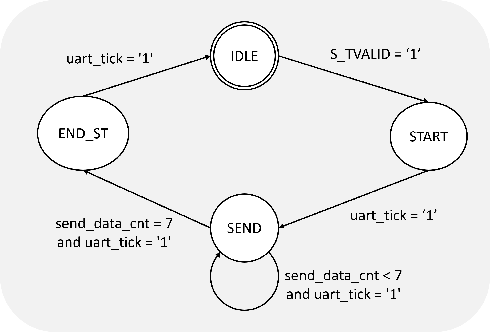

# SOPC Project – Custom UART IP Development

## Introduction

This project focuses on the design and implementation of a **custom UART (Universal Asynchronous Receiver Transmitter) IP** for FPGA platforms. It aims to replicate an industry-style hardware development workflow by building a reusable and modular IP block from scratch. The UART IP is designed to enable asynchronous serial communication with external devices such as a computer or another FPGA, following the UART protocol. 

## Features & Specifications

The custom UART IP must comply with the following initial configuration:

| Feature       | Value  |
|--------------|--------|
| Baud Rate     | 9600   |
| Parity        | None   |
| Data Bits     | 8      |
| Stop Bits     | 1      |

*Note: If time permits, these parameters will be made dynamically configurable.*

The IP is designed to support:
- **Transmission (TX) and reception (RX)** over UART.
- **Integration as a peripheral** for the **Nios II softcore** via the **Avalon bus**.
- **AXI-Stream (AXIS) protocol** for internal communication between IP sub-blocks (using `tdata`, `tvalid`, and `tready` signals).

## IP Architecture Overview

### Block Diagram

The IP is composed of four main modules:
- `Wrapper`: Translates Avalon requests from Nios II to AXIS for UART submodules.
- `UART_TX`: Converts AXIS data to UART serial frame.
- `UART_RX`: Receives UART frames and converts them into AXIS data.
- `UART_CRL`: (Optional) Manages dynamic configuration (baud rate, parity, etc.).

### AXI-Stream Justification

AXI-Stream is used internally for its robustness and simplicity. Only the essential signals (`tdata`, `tvalid`, `tready`) are used.

## UART_TX Module

### Architecture

The TX path is designed to convert parallel data into UART serial frames. It includes:
- A **state machine (FSM)** to manage frame construction.
- A **rate controller** to generate transmission ticks based on the system clock (50 MHz vs. 9600 baud).
- A **FIFO buffer** to manage clock domain and speed mismatches.

### FSM States

1. `IDLE`: Wait for data.
2. `START`: Send UART start bit.
3. `SEND`: Transmit 8-bit data.
4. `END_ST`: Send UART stop bit.

> **Why a FIFO?**  
Due to the speed difference between the Nios II and UART transmission, data could be lost if not buffered. The FIFO helps absorb this mismatch by queuing bytes to be transmitted.

## UART_RX Module

### Architecture

The RX path handles asynchronous UART reception and includes:
- A **FSM** for UART start bit detection and data acquisition.
- A **rate generator** to properly sample data bits.
- A **FIFO** to store received bytes while interrupting the Nios II processor.

### FSM States

1. `IDLE`: Monitor for UART start bit.
2. `START`: Wait half a baud to center sampling.
3. `RECEIVE`: Sample and store each bit.
4. `END_ST`: Reset and return to idle.
